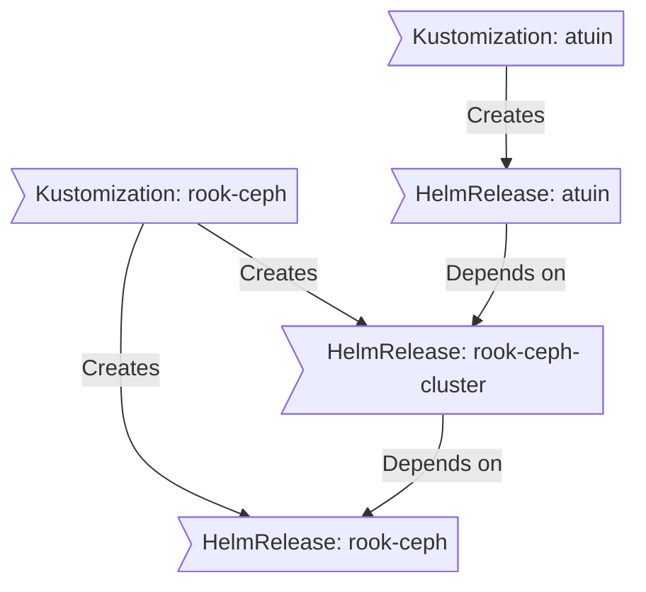
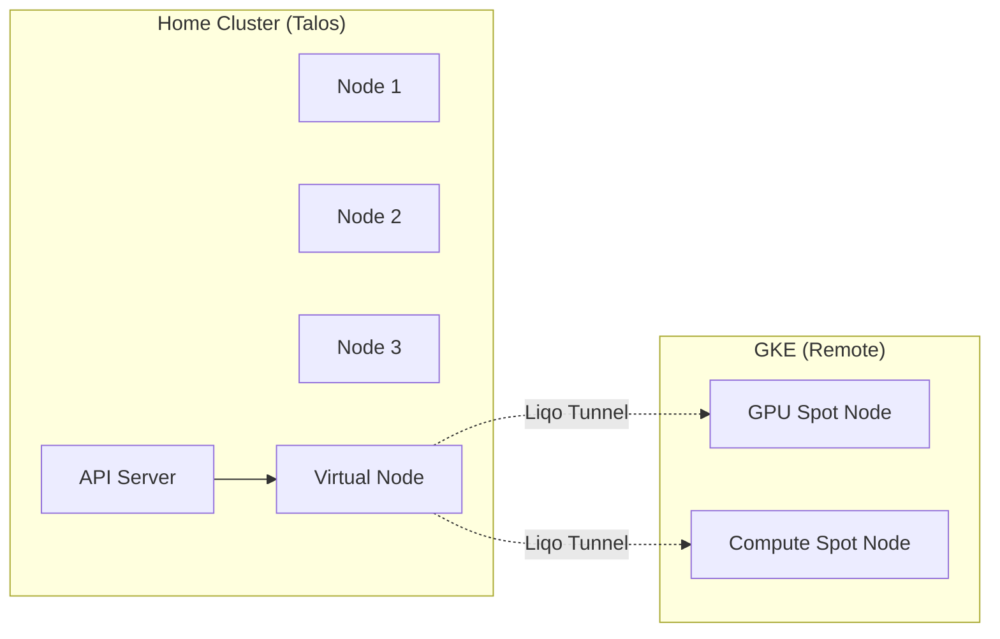

<div align="center">


###  My Home Operations Repository 

_... managed with Flux, Renovate, and GitHub Actions_ 

</div>

<div align="center">

[](https://talos.dev)&nbsp;&nbsp;
[](https://kubernetes.io)&nbsp;&nbsp;
[](https://fluxcd.io)&nbsp;&nbsp;

[](https://github.com/solanyn/home-ops/actions/workflows/renovate.yaml)

</div>

<div align="center">

[](https://status.goyangi.io)&nbsp;&nbsp;
[](https://status.goyangi.io)&nbsp;&nbsp;
[](https://status.goyangi.io)

</div>

<div align="center">

[](https://github.com/kashalls/kromgo)&nbsp;&nbsp;
[](https://github.com/kashalls/kromgo)&nbsp;&nbsp;
[](https://github.com/kashalls/kromgo)&nbsp;&nbsp;
[](https://github.com/kashalls/kromgo)&nbsp;&nbsp;
[](https://github.com/kashalls/kromgo)&nbsp;&nbsp;
[](https://github.com/kashalls/kromgo)&nbsp;&nbsp;
[](https://github.com/kashalls/kromgo)

</div>

---

##  Overview

This is a mono repository for my home infrastructure and Kubernetes cluster. It doubles as a production-grade platform engineering reference, running enterprise tooling on bare metal to validate real-world patterns for AI/ML platforms, data engineering and platform operations.

The cluster manages ~100 applications across 24 namespaces, covering everything from a full Kubeflow ML platform and real-time streaming pipelines to home automation and media services -- all deployed through GitOps with FluxCD.

There is a template at [onedr0p/cluster-template](https://github.com/onedr0p/cluster-template) if you want to follow along with some of the practices used here.

---

##  Platform Capabilities

### AI/ML Platform

A complete machine learning platform built on [Kubeflow](https://github.com/kubeflow/kubeflow), providing end-to-end ML lifecycle management from data annotation through to production model serving:

- [kserve](https://github.com/kserve/kserve) and [knative](https://github.com/knative/serving) for serverless model inference with autoscaling and scale-to-zero
- [kgateway](https://github.com/kgateway-dev/kgateway) as an AI-native API gateway with LLM routing, MCP server integration and security policies
- [kuberay-operator](https://github.com/ray-project/kuberay) for distributed training and hyperparameter tuning
- [spark-operator](https://github.com/kubeflow/spark-operator) for large-scale data processing within ML pipelines
- [katib](https://github.com/kubeflow/katib) for automated hyperparameter tuning and neural architecture search
- [feast](https://github.com/feast-dev/feast) as a feature store for online/offline feature serving
- [mlflow](https://github.com/mlflow/mlflow) for experiment tracking and model registry
- [label-studio](https://github.com/heartexlabs/label-studio) for data annotation and dataset preparation
- [agent-sandbox](https://github.com/anomalyco/agent-sandbox) for sandboxed AI agent execution

### Data Engineering & Streaming

Production data infrastructure for real-time and batch processing:

- [kafka](https://github.com/apache/kafka) for event streaming and real-time data ingestion
- [flink](https://github.com/apache/flink) for stateful stream processing and real-time analytics
- [trino](https://github.com/trinodb/trino) as a distributed SQL query engine across heterogeneous data sources
- [argo-workflows](https://github.com/argoproj/argo-workflows) for DAG-based workflow orchestration

### Networking & Service Mesh

Dual-stack IPv4/IPv6 networking with BGP-based load balancing and Kubernetes Gateway API:

- [cilium](https://github.com/cilium/cilium) as the CNI with eBPF-based network policies, BGP peering and L2/L3 load balancing
- [envoy](https://github.com/envoyproxy/envoy) gateway with Kubernetes Gateway API for north-south traffic management
- [kgateway](https://github.com/kgateway-dev/kgateway) for AI/LLM-aware routing with MCP tool proxying
- [multus](https://github.com/k8snetworkplumbingwg/multus-cni) for cross-VLAN pod networking
- [external-dns](https://github.com/kubernetes-sigs/external-dns) for automated split-horizon DNS across Cloudflare and UniFi

### Security & Identity

Zero-trust security model with policy enforcement and centralised identity:

- [pocket-id](https://github.com/pocket-id/pocket-id) as the OIDC provider with passkey-based SSO (no passwords)
- [external-secrets](https://github.com/external-secrets/external-secrets) with [1Password Connect](https://github.com/1Password/connect) for secret injection
- [cert-manager](https://github.com/cert-manager/cert-manager) for automated TLS certificate lifecycle

### Observability

Full-stack monitoring with long-term metric retention, distributed tracing and LLM observability:

- [prometheus](https://github.com/prometheus/prometheus) via kube-prometheus-stack for metrics collection and alerting
- [thanos](https://github.com/thanos-io/thanos) for highly available Prometheus with long-term object storage
- [grafana](https://github.com/grafana/grafana) for dashboarding across metrics, logs and traces
- [opentelemetry](https://github.com/open-telemetry/opentelemetry-collector) collector with eBPF auto-instrumentation for distributed tracing
- [clickhouse](https://github.com/ClickHouse/ClickHouse) for high-performance trace and log storage
- [langfuse](https://github.com/langfuse/langfuse) for LLM observability, prompt management and evaluation
- [victoria-logs](https://github.com/VictoriaMetrics/VictoriaMetrics) and [fluent-bit](https://github.com/fluent/fluent-bit) for log aggregation
- [gatus](https://github.com/TwiN/gatus) for endpoint health monitoring and status pages
- [blackbox-exporter](https://github.com/prometheus/blackbox_exporter), [smartctl-exporter](https://github.com/prometheus-community/smartctl_exporter) and [unpoller](https://github.com/unpoller/unpoller) for infrastructure probing
- [silence-operator](https://github.com/giantswarm/silence-operator) and [kromgo](https://github.com/kashalls/kromgo) for alert management and badge generation

### Storage & Databases

Distributed and local storage with operator-managed databases:

- [rook-ceph](https://github.com/rook/rook) for distributed block, object and filesystem storage
- [cloudnative-pg](https://github.com/cloudnative-pg/cloudnative-pg) for production PostgreSQL with automated backups and failover
- [dragonfly](https://github.com/dragonflydb/dragonfly) as a high-performance Redis-compatible in-memory store
- [garage](https://github.com/deuxfleurs-org/garage) for S3-compatible distributed object storage (backups, Thanos, CNPG WAL archival)
- [mariadb](https://github.com/mariadb-operator/mariadb-operator) operator for MySQL-compatible workloads
- [influxdb](https://github.com/influxdata/influxdb) for time-series data and IoT metrics
- [vernemq](https://github.com/vernemq/vernemq) as an MQTT broker for IoT device communication
- [openebs](https://github.com/openebs/openebs) for local PV provisioning
- [volsync](https://github.com/backube/volsync) and [kopia](https://github.com/kopia/kopia) for encrypted backup orchestration

### Multi-Cluster & Cloud Burst

On-demand GPU/CPU capacity via workload offloading to GKE:

- [liqo](https://github.com/liqotech/liqo) for transparent multi-cluster workload offloading over WireGuard
- [crossplane](https://github.com/crossplane/crossplane) for declarative GKE cluster provisioning as Kubernetes CRDs
- One-way offloading from home cluster to GKE for GPU workloads
- Autoscaling node pools with scale-to-zero when idle (spot instances for cost efficiency)

### Infrastructure Provisioning & GitOps

Declarative cluster management with dependency-aware deployments:

- [flux](https://github.com/fluxcd/flux2) for Git-based state reconciliation with drift detection and self-healing
- [renovate](https://github.com/renovatebot/renovate) for automated dependency updates across the entire repository
- [actions-runner-controller](https://github.com/actions/actions-runner-controller) for self-hosted CI/CD runners
- [keda](https://github.com/kedacore/keda) for event-driven autoscaling
- [spegel](https://github.com/spegel-org/spegel) for peer-to-peer OCI image distribution

---

##  Repository Structure

```sh
📁 kubernetes
├── 📁 apps           # applications across 24 namespaces
├── 📁 components     # reusable Kustomize components (volsync, alerts, nfs-scaler)
└── 📁 flux           # Flux system configuration
📁 talos              # Talos Linux node configuration (Jinja2 templates)
📁 bootstrap          # cluster bootstrapping resources
```

### Dependency Management

Applications deploy in dependency order based on infrastructure requirements, preventing race conditions.



---

##  Hybrid Cloud Strategy

The setup maximises self-hosted infrastructure whilst using cloud services where appropriate.

| Service                                     | Use                                                               | Cost (AUD)    |
| ------------------------------------------- | ----------------------------------------------------------------- | ------------- |
| [1Password](https://1password.com/)         | Secrets with [External Secrets](https://external-secrets.io/)     | ~$50/yr       |
| [Cloudflare](https://www.cloudflare.com/)   | Domains and S3                                                    | ~$30/yr       |
| [GitHub](https://github.com/)               | Hosting this repository and continuous integration/deployments    | Free          |
| [Pushover](https://pushover.net/)           | Kubernetes Alerts and application notifications                   | $5 OTP        |
| [healthchecks.io](https://healthchecks.io/) | Monitoring internet connectivity and external facing applications | Free          |
|                                             |                                                                   | Total: ~$7/mo |



---

##  DNS Architecture

The cluster implements automated split-horizon DNS across multiple zones:

- Internal zone management via UniFi controller integration using webhook providers
- Public DNS automation with Cloudflare API integration
- Dynamic DNS updates for public IP tracking via cloudflare-ddns
- Traffic segmentation through gateway-based routing (`envoy-internal`/`envoy-external`)
- Zero-touch operations with automatic record lifecycle management

This pattern enables secure service exposure whilst maintaining internal network isolation.

---

##  Hardware

| Device              | OS Disk             | Data Disk           | Memory | OS            | Function            |
| ------------------- | ------------------- | ------------------- | ------ | ------------- | ------------------- |
| Dell Optiplex 7050  | Samsung PM863 960GB | Micron 7450 Pro 960GB | 32GB   | Talos         | Kubernetes          |
| Dell Optiplex 7060  | Samsung PM863 960GB | Micron 7450 Pro 960GB | 32GB   | Talos         | Kubernetes          |
| Dell Optiplex 7060  | Samsung PM863 960GB | Micron 7450 Pro 960GB | 32GB   | Talos         | Kubernetes          |
| NAS (Repurposed PC) | 512GB               | 1x12TB ZFS          | 16GB   | TrueNAS SCALE | NFS + Backup Server |
| UniFi UCG Ultra     | -                   | -                   | -      | -             | Router              |

---

##  Gratitude and Thanks

Thanks to all the people who donate their time to the [Home Operations](https://discord.gg/home-operations) Discord community. Be sure to check out [kubesearch.dev](https://kubesearch.dev/) for ideas on how to deploy applications or get ideas on what you could deploy.
