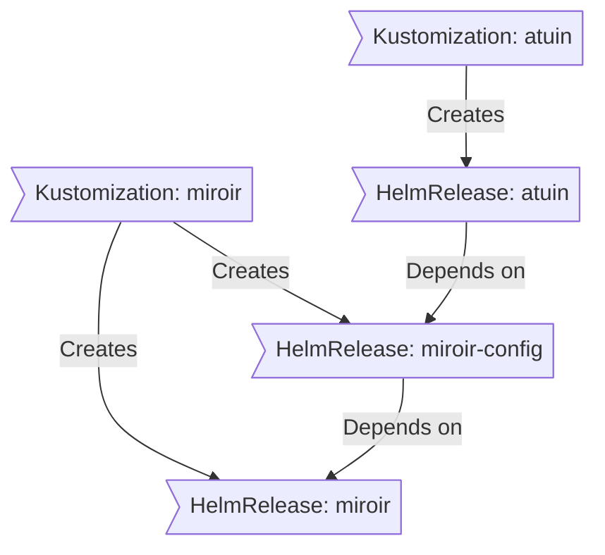

<div align="center">


###  My Home Operations Repository 

_... managed with Flux, Renovate, and GitHub Actions_ 

</div>

<div align="center">

[](https://status.goyangi.io)&nbsp;&nbsp;
[](https://status.goyangi.io)&nbsp;&nbsp;
[](https://status.goyangi.io)

</div>

<div align="center">

[](https://discord.gg/home-operations)&nbsp;&nbsp;
[](https://talos.dev)&nbsp;&nbsp;
[](https://kubernetes.io)&nbsp;&nbsp;
[](https://fluxcd.io)&nbsp;&nbsp;
[](https://github.com/solanyn/home-ops/actions/workflows/renovate.yaml)

</div>

<div align="center">

[](https://github.com/kashalls/kromgo)&nbsp;&nbsp;
[](https://github.com/kashalls/kromgo)&nbsp;&nbsp;
[](https://github.com/kashalls/kromgo)&nbsp;&nbsp;
[](https://github.com/kashalls/kromgo)&nbsp;&nbsp;
[](https://github.com/kashalls/kromgo)&nbsp;&nbsp;
[](https://github.com/kashalls/kromgo)&nbsp;&nbsp;
[](https://github.com/kashalls/kromgo)

</div>

---

##  Overview

This is a mono repository for my home infrastructure and Kubernetes cluster. I try to adhere to Infrastructure as Code (IaC) and GitOps practices using tools like [OpenTofu](https://opentofu.org/), [Kubernetes](https://kubernetes.io/), [Flux](https://github.com/fluxcd/flux2), [Renovate](https://github.com/renovatebot/renovate), and [GitHub Actions](https://github.com/features/actions).

---

##  Kubernetes

My Kubernetes cluster is deployed with [Talos](https://www.talos.dev). This is a semi-hyper-converged cluster, workloads and block storage are sharing the same available resources on my nodes while I have a separate server with ZFS for NFS shares, bulk file storage and backups.

There is a template over at [onedr0p/cluster-template](https://github.com/onedr0p/cluster-template) if you want to try and follow along with some of the practices I use here.

### Core Components

- **Networking & Service Mesh**: [cilium](https://github.com/cilium/cilium) provides eBPF-based networking, BGP peering and load balancing, while [envoy](https://github.com/envoyproxy/envoy) powers north-south traffic management via the Kubernetes Gateway API. [multus](https://github.com/k8snetworkplumbingwg/multus-cni) enables cross-VLAN pod networking, and [external-dns](https://github.com/kubernetes-sigs/external-dns) keeps DNS records in sync automatically.
- **Security & Secrets**: [cert-manager](https://github.com/cert-manager/cert-manager) automates SSL/TLS certificate management. [pocket-id](https://github.com/pocket-id/pocket-id) provides passkey-based SSO as my OIDC provider. For secrets, I use [external-secrets](https://github.com/external-secrets/external-secrets) with [1Password Connect](https://github.com/1Password/connect) to inject secrets into Kubernetes.
- **Storage & Data Protection**: [miroir](https://github.com/home-operations/miroir) provides distributed block storage with DRBD replication, with [kopiur](https://github.com/home-operations/kopiur) handling backups and restores. [spegel](https://github.com/spegel-org/spegel) improves reliability by running a stateless, cluster-local OCI image mirror.
- **Automation & CI/CD**: [actions-runner-controller](https://github.com/actions/actions-runner-controller) runs self-hosted GitHub Actions runners directly in the cluster for continuous integration workflows.

### GitOps

[Flux](https://github.com/fluxcd/flux2) watches the cluster in my [kubernetes](./kubernetes/) folder (see Directories below) and makes the changes to my cluster based on the state of my Git repository.

The way Flux works for me here is it will recursively search the `kubernetes/apps` folder until it finds the most top level `kustomization.yaml` per directory and then apply all the resources listed in it. That aforementioned `kustomization.yaml` will generally only have a namespace resource and one or many Flux kustomizations (`ks.yaml`). Under the control of those Flux kustomizations there will be a `HelmRelease` or other resources related to the application which will be applied.

[Renovate](https://github.com/renovatebot/renovate) watches my **entire** repository looking for dependency updates, when they are found a PR is automatically created. When some PRs are merged Flux applies the changes to my cluster.

### Directories

This Git repository contains the following directories under [Kubernetes](./kubernetes/).

```sh
📁 kubernetes
├── 📁 apps       # applications
├── 📁 components # re-useable kustomize components
└── 📁 flux       # flux system configuration
```

### Flux Workflow

This is a high-level look how Flux deploys my applications with dependencies. In most cases a `HelmRelease` will depend on other `HelmRelease`'s, in other cases a `Kustomization` will depend on other `Kustomization`'s, and in rare situations an app can depend on a `HelmRelease` and a `Kustomization`. The example below shows that `atuin` won't be deployed or upgrade until the `miroir` Helm release is installed or in a healthy state.


```mermaid
graph TD
    A>Kustomization: miroir] -->|Creates| B[HelmRelease: miroir]
    A>Kustomization: miroir] -->|Creates| C[HelmRelease: miroir-config]
    C>HelmRelease: miroir-config] -->|Depends on| B>HelmRelease: miroir]
    D>Kustomization: atuin] -->|Creates| E(HelmRelease: atuin)
    E>HelmRelease: atuin] -->|Depends on| C>HelmRelease: miroir-config]
```

---

##  Cloud Dependencies

While most of my infrastructure and workloads are self-hosted I do rely upon the cloud for certain key parts of my setup. This saves me from having to worry about three things. (1) Dealing with chicken/egg scenarios, (2) services I critically need whether my cluster is online or not and (3) The "hit by a bus factor" - what happens to critical apps that my family relies on when I no longer around.

| Service                                     | Use                                                               | Cost (AUD)    |
| ------------------------------------------- | ----------------------------------------------------------------- | ------------- |
| [1Password](https://1password.com/)         | Secrets with [External Secrets](https://external-secrets.io/)     | ~$50/yr       |
| [Cloudflare](https://www.cloudflare.com/)   | Domains and S3                                                    | ~$30/yr       |
| [GitHub](https://github.com/)               | Hosting this repository and continuous integration/deployments    | Free          |
| [Pushover](https://pushover.net/)           | Kubernetes Alerts and application notifications                   | $5 OTP        |
| [healthchecks.io](https://healthchecks.io/) | Monitoring internet connectivity and external facing applications | Free          |
|                                             |                                                                   | Total: ~$7/mo |

---

##  DNS

In my cluster there are two instances of [ExternalDNS](https://github.com/kubernetes-sigs/external-dns) running. One for syncing private DNS records to my [UniFi](https://ui.com/) controller using [ExternalDNS webhook provider for UniFi](https://github.com/kashalls/external-dns-unifi-webhook), while another instance syncs public DNS to `Cloudflare`. This setup is managed by creating ingresses with two specific classes: `internal` for private DNS and `external` for public DNS. The `external-dns` instances then sync the DNS records to their respective platforms accordingly.

---

##  Hardware

| Device              | OS Disk             | Data Disk             | Memory | OS            | Function            |
| ------------------- | ------------------- | --------------------- | ------ | ------------- | ------------------- |
| Dell Optiplex 7050  | Samsung PM863 960GB | Micron 7450 Pro 960GB | 32GB   | Talos         | Kubernetes          |
| Dell Optiplex 7060  | Samsung PM863 960GB | Micron 7450 Pro 960GB | 32GB   | Talos         | Kubernetes          |
| Dell Optiplex 7060  | Samsung PM863 960GB | Micron 7450 Pro 960GB | 32GB   | Talos         | Kubernetes          |
| NAS (Repurposed PC) | 512GB               | 1x12TB ZFS            | 16GB   | TrueNAS SCALE | NFS + Backup Server |
| UniFi UCG Ultra     | -                   | -                     | -      | -             | Router              |

---

##  Gratitude and Thanks

Thanks to all the people who donate their time to the [Home Operations](https://discord.gg/home-operations) Discord community. Be sure to check out [kubesearch.dev](https://kubesearch.dev/) for ideas on how to deploy applications or get ideas on what you could deploy.
